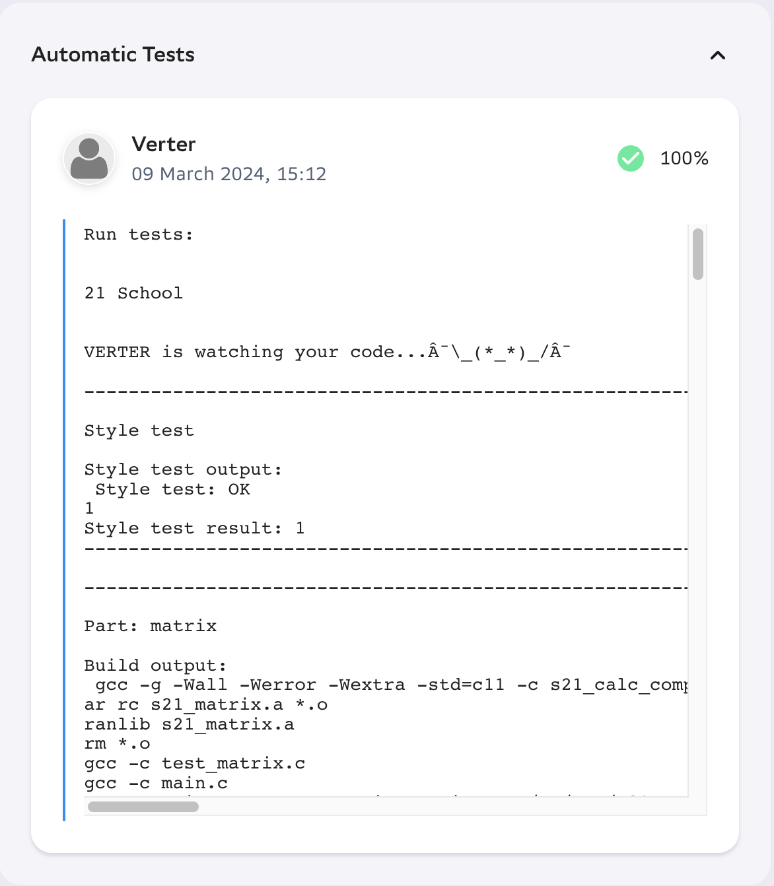

# Matrix Operations Library (matrix.h)

## Description
Welcome to the Matrix Operations Library, a versatile C library providing a comprehensive set of functions for working with matrices. Whether you're a mathematician, scientist, or software developer, this library offers everything you need to manipulate matrices efficiently.

<div style="text-align: center;">
    
</div>


## About
This project was created as a task for school 21.

## Features
- **Create Matrix:** Easily create matrices of any size and dimension.
- **Remove Matrix:** Safely remove and destroy matrices to free up memory.
- **Matrix Operations:** Perform essential operations such as addition, subtraction, and multiplication with ease.
- **Scalar Operations:** Multiply matrices by scalars for scaling and adjustment.
- **Transpose:** Quickly transpose matrices for transformation and analysis.
- **Determinant:** Compute the determinant of square matrices effortlessly.
- **Cofactors:** Calculate matrix cofactors for advanced mathematical operations.
- **Inverse Matrix:** Find the inverse of square matrices for solving equations and more.

## Getting Started
### Installation

1. Clone the repository:
    ```bash
    git clone <repository_ssh>
    ```

2. Navigate to the project directory:
    ```bash
    cd s21_matrix_c
    ```

3. Navigate to the source directory:
    ```bash
    cd src
    ```

4. Build the project using Makefile:
    ```bash
    make
    ```

### Testing

1. To run tests and display coverage:
    ```bash
    make test
   ./test
    ```

2. View the coverage report.
    ```bash
    make gcov_report
    ```

### Automatic Tests


   
## Contributions
Contributions are welcome! Whether you're fixing a bug, adding a new feature, or improving documentation, your contributions help make this library better for everyone. Please follow the guidelines in the `CONTRIBUTING.md` file when submitting pull requests.

